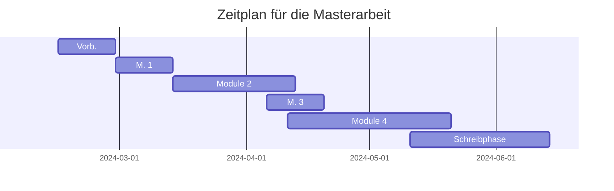

## Allgemeine Informationen

**Titel:** Publikationspraktiken für Forschungsdaten in Hochschulschriften 
**Untertitel:** Eine Untersuchung der Veröffentlichungsformate und -methoden

**Universität:** [Humboldt-Universität zu Berlin](https://www.hu-berlin.de/) 
**Fakultät:** [Philosophische Fakultät](https://fakultaeten.hu-berlin.de/de/philfak) 
**Institut:** [Institut für Bibliotheks- und Informationswissenschaft](https://www.ibi.hu-berlin.de/de)

**Gutachter 1:** [Dr. Sarah Dellmann](https://www.tib.eu/de/publizieren-archivieren/beratung-und-information/ansprechpersonen-und-serviceadressen) 
**Gutachter 2:** [Prof. Dr. Robert Jäschke](https://amor.cms.hu-berlin.de/~jaeschkr/)

## Exposé

### Einführung

Es gibt drei Publikationsformen für Forschungsdaten (FD) in Hochschulschriften (HSS) :

1. Vollständig in HSS integrierte Daten (z.B. Tabellen und Grafiken, die in der PDF-Datei der HSS eingebettet worden sind),
2. HSS-beigefügte Daten (z.B. Dateien, die gemeinsam mit der PDF-Datei der Hochschulschrift auf den Publikationsserver der Hochschule hochgeladen worden sind)
3. Auf ein separates Repositorium hochgeladene Daten, auf die innerhalb der HSS verwiesen wird

Im wissenschaftlichen Kontext geben präskriptive Artikel aus dem DFG-Förderprojekt _eDissPlus_  sowie die _Policy für dissertationsbezogene Forschungsdaten_ der Deutschen Nationalbibliothek  vermehrt Richtlinien für den Umgang mit FD für HSS. Es fehlen bisher allerdings umfassende Studien zur Wirksamkeit bzw. Durchsetzung dieser Richtlinien bei Studierenden (z.B. durch entsprechende Prüfungsordnungen und Beratungen zu diesem Thema durch Universitätsbibliotheken). Hier existieren bisher höchstens hochspezialisierte und fachbezogene Untersuchungen.

Diese Masterarbeit beabsichtigt, hierzu eine allgemeinere Untersuchung darzubieten.

### Forschungsfrage

#### Hauptforschungsfrage

Auf welche Art und Weise wurden im institutionellen Repositorium der Leibniz Universität Hannover (LUH-Repositorium) FD von HSS bis inkl. Dezember 2023 publiziert?

Diese lässt sich in folgende untergeordnete Forschungsfragen aufgliedern:

1. Für welchen Anteil an HSS wurden FD als Teil der PDF-Datei publiziert?
2. Für welchen Anteil an HSS wurden FD als separate Datei in Form eines Supplements publiziert?
3. Für welchen Anteil an HSS wurden FD in einem separaten Repositorium publiziert?
4. Wie werden FD in HSS ausgezeichnet und mit dem Text der HSS verlinkt?
5. Wie wird in den Metadaten von HSS sichtbar gemacht, dass es zugehörige Forschungsdaten gibt?

#### Nebenforschungsfrage

Inwiefern wurden Empfehlung bezüglich FD in HSS bereits in Prüfungsordnungen und anderen leitführenden Dokumenten an deutschen Universitäten verankert?

### Methodologie

Für die Beantwortung dieser Forschungsfragen wird der Arbeitsprozess für die Masterarbeit in vier Module aufgegliedert:

1. Die Analyse von deutschen Promotionsordnungen und übergreifenden Richtlinien in Bezug auf FD
2. Die manuelle Klassifikation der HSS im LUH-Repositorium in Bezug auf FD
3. Die Auswertung der Ergebnisse aus den beiden vorherigen Modulen mit Schwerpunkt auf mögliche Handlungsempfehlungen in Bezug auf FD
4. Das Training eines Modells zur automatischen Klassifizierung von HSS in Bezug auf FD auf Basis der Ergebnisse der vorhergegangen manuellen Klassifikationsarbeit

#### Modul 1: Promotionsordnungen

Hier werden die Promotionsordnungen und andere relevante leitführende Dokumente einer einfachen Stichprobe (n=173) aller promotionsberechtigter Hochschulen in Deutschland (n=313) untersucht. Die Stichprobengröße wurde mit einem Konfidenzintervall von 95&thinsp;% und einer Fehlerspanne von 5&thinsp;% berechnet.

#### Modul 2: Manuelle HSS-Klassifikation

Hier wird eine mehrschichtige Stichprobe der HSS im LUH-Repositorium manuell danach klassifiziert ob die HSS,

1. keine FD,
2. FD als Teil der PDF-Datei,
3. FD als beigefügte Datei(en) oder
4. FD in einem externen Repositorium haben.

Die Stichprobe ist geschichtet nach den Fakultäten der LUH und nach vier 3-Jahres-Etappen. Für dieses Modul erhalte ich administrativen Zugriff auf das LUH-Repositorium. Die genaue Stichprobengröße kann erst mit diesem Zugriff berechnet werden. Die Klassifikation selber beachtet den Inhalt der PDF-Datei sowie der sich im LUH-Repositorium befindenden assoziierten Metadaten.

#### Modul 3: Auswertung & Empfehlungen

Hier werden die Ergebnisse der ersten beiden Module ausgewertet und anhand der gewonnenen Daten Konzepte entwickelt, wie ein besserer Umgang mit FD in HSS erzielt werden kann und an welche Zielgruppen diese Bemühungen sich am ehesten richten sollten.

#### Modul 4: Training des Klassifikationsmodells

Hier werden die Ergebnisse der vorangegangen Klassifikationsarbeit genutzt um ein Modell zu trainieren, welches dann die restlichen HSS im LUH-Repositorium nach FD-Status klassifizieren können soll. Das Training und der Aufbau des Modells orientiert sich, zumindest erwartungsgemäß, nach Younes und Scherps Arbeit zur Identifizierung und Extraktion von Datensätzen in wissenschaftlichen Artikeln .

Je nachdem ob die LUH die Ressourcen für eine Kontrolle der Ergebnisse hat, wird hier entweder ein einstufiges Verfahren (direkte Identifizierung und Extraktion via ein prätrainiertes Sprachmodell wie DeBERTa in Frage-Antwort-Modus) oder ein zweistufiges Verfahren (Filterung via ein MLP mit anschließender Extraktion via ein prätrainiertes Sprachmodell wie RoBERTa) genutzt. Ersteres hat (nach bisherigen Erwartungen) eine höhere Präzision und bedarf daher weniger Nachbearbeitung, besitzt dafür aber einen geringeren Recall. Letzteres hat (nach bisherigen Erwartungen) einen höheren Recall aber dafür eine geringere Präzision.

### Zeitplan

    <b>Abbildung:</b> Ein provisorischer Zeitplan für die Bearbeitung der Masterarbeit als Gantt-Diagramm.

### PDF-Version

Eine PDF-Version dieses Exposés (ohne Gantt-Zeitplan) kann [hier](https://david.krassnig.de/assets/pdf/krassnig-mathesis-expose.pdf) heruntergeladen werden.

## Aktueller Status

- [x] **Vorbereitungsphase**
  - [x] (Lua)LaTeX-Template erstellen (auf [GitHub](https://github.com/DavidKrassnig/abschlussarbeit_lualatex_vorlage_hu-berlin) verfügbar)
  - [x] Zugriff auf [TIB Confluence](https://wiki.tib.eu/confluence/) erhalten
  - [x] Zugriff auf [TIB Remote Desktop](https://rdgw01.rds.tib.eu/) erhalten
    - [ ] ~~Optional: Zugriff auch auf Linux-System zum Laufen bringen~~
  - [x] Administrativen Zugriff auf das [LUH-Repositorium](https://www.repo.uni-hannover.de/) erhalten
- [x] **Bearbeitungsphase**
  - [x] Modul 1
    - [x] Liste aller deutscher Universitäten
    - [x] Liste nach Promotionsberechtigung filtern
    - [x] Skript erstellen für seed-basierte zufällige Auswahl aus Universitätenliste (**Resultat:** [hier](https://github.com/DavidKrassnig/simple-csv-sampler) herunterladbar)
    - [x] Einfache Stichprobe nehmen
    - [x] Promotionsordnungen & weitere relevante Dokumente der Stichprobe sammeln
    - [x] Promotionsordnungen der Stichprobe evaluieren
  - [x] Modul 2
    - [x] Metadaten aller [LUH Repository](https://www.repo.uni-hannover.de/)-Dissertationen herunterladen
    - [x] Methode finden, alle relevanten Dateien automatisiert herunterzuladen
      - [x] Überprüfen ob entsprechende DSpace 5 Funktion existiert (**Resultat:** nicht verfügbar)
      - [x] Skript für den automatischen Download aller PDF-Dateien und begleitenden Dateien erstellen
    - [x] Skript für die automatische Einteilung in Schichten nach Jahr+Fakultät-Gruppen erstellen
    - [x] Mehrschichtige Zufallsprobe ziehen
      - [x] Reevaluation der Schichten (**Resultat:** Wandel von 3-Jahres-Gruppierungen mit je 4 Jahren zu 4-Jahres-Gruppierungen mit je 3 Jahren)
    - [x] Alle relevanten Dateien herunterladen
    - [x] Metadaten-Schemata für Forschungsdaten entscheiden für nachträglichen Upload der Klassifizierung zu DSpace
    - [x] Alle Dissertationen evaluieren
      - [x] Überprüfen auf interne Forschungsdaten
      - [x] Überprüfen auf beigefügte Forschungsdaten
      - [x] Überprüfen auf externe Forschungsdaten
  - [x] Modul 3
  - [x] Modul 4
    - [x] PDF-Dateien sortieren
    - [x] Grobid installieren
    - [x] PDF-Dateien zu TEI-XML-Dateien konvertieren
    - [x] TEI-XML-Dateien nach Sprache sortieren
    - [x] TEI-XML-Dateien auf Qualität untersuchen
    - [x] CSV-Datensatz erstellen (basierend auf Paragrafen)
    - [x] Paragrafen des Datensatzes klassifizieren
    - [x] Skript zum Trainieren des Modells schreiben
    - [x] Leistung evaluieren
- [x] **Schreibphase**
  - [x] Einführung
    - [x] Erster Draft
  - [x] Modul 1
    - [x] Erster Draft
    - [x] Finale Version
  - [x] Modul 2
    - [x] Erster Draft
    - [x] Finale Version
  - [x] Modul 3
    - [x] Erster Draft
    - [x] Finale Version
  - [ ] ~~Modul 4~~ (zu wenig Datenpunkte)
  - [x] Schluss
- [x] **Abgabe**
  - [x] Mit Sperrfrist auf Zenodo hochladen
    - [x] Masterarbeit (**DOI:** [10.5281/zenodo.11506621](https://www.doi.org/10.5281/zenodo.11506621))
    - [x] Datensatz (**DOI:** [10.5281/zenodo.11401021](https://www.doi.org/10.5281/zenodo.11401021))
  - [x] In den Druck geben
  - [x] Per Post verschicken
  - [x] Per E-Mail verschicken
