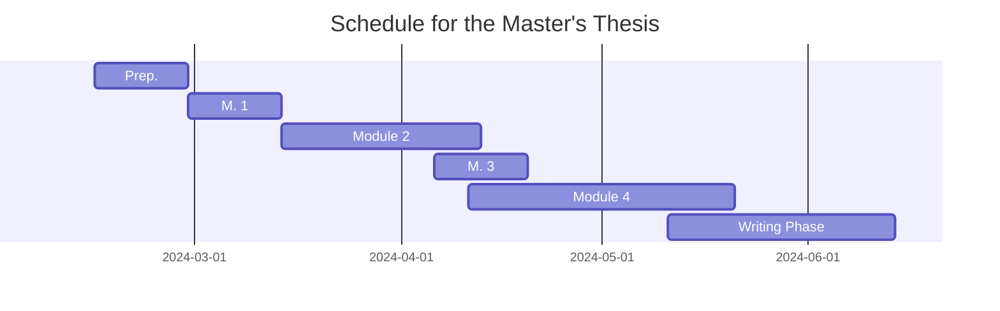

(this document is originally [in German](https://david.krassnig.de/de/projects/ma-thesis/))

## General Information

**Title:** Publication Practices for Research Data in University Theses 
**Subtitle:** An Examination of Publication Formats and Methods

**University:** [Humboldt University of Berlin](https://www.hu-berlin.de/en) 
**Faculty:** [Faculty of Philosophy](https://fakultaeten.hu-berlin.de/de/philfak) 
**Institute:** [Institute of Library and Information Science](https://www.ibi.hu-berlin.de/en)

**Reviewer 1:** [Dr. Sarah Dellmann](https://www.tib.eu/en/publishing-archiving/advisory-services-and-information/contact-persons-and-addresses-for-service) 
**Reviewer 2:** [Prof. Dr. Robert Jäschke](https://amor.cms.hu-berlin.de/~jaeschkr/)

## Exposé

### Introduction

There are three publication forms for research data (RD) in academic theses (AT) :

1. Fully integrated data in AT (e.g., tables and graphics embedded in the PDF file of the AT),
2. Data attached to AT (e.g., files uploaded to the university's publication server along with the PDF file of the thesis)
3. Data uploaded to a separate repository referenced within the AT

In the academic context, prescriptive articles from the DFG-funded project _eDissPlus_  as well as the _Policy for Dissertation-related Research Data_ of the German National Library  increasingly provide guidelines for handling RD for AT. However, comprehensive studies on the effectiveness or enforcement of these guidelines among students are lacking (e.g., through corresponding examination regulations and consultations on this topic by university libraries). So far, there are at most highly specialized and discipline-specific studies.

This master's thesis intends to provide a more general investigation in this regard.

### Research Question

#### Main Research Question

In what way were RD from AT published in the institutional repository of Leibniz University Hannover (LUH Repository) until December 2023?

This can be divided into the following subordinate research questions:

1. What proportion of AT had RD published as part of the PDF file?
2. What proportion of AT had RD published as a separate file in the form of a supplement?
3. What proportion of AT had RD published in a separate repository?
4. How are RD in AT distinguished and linked with the text of the AT?
5. How is it made visible in the metadata of AT that there are associated research data?

#### Subsidiary Research Question

To what extent have recommendations regarding RD in AT already been anchored in examination regulations and other guiding documents at German universities?

### Methodology

For answering these research questions, the work process for the master's thesis is divided into four modules:

1. The analysis of German doctoral regulations and overarching guidelines regarding RD.
2. The manual classification of AT in the LUH Repository regarding RD.
3. The evaluation of the results from the first two modules focusing on potential recommendations regarding RD.
4. The training of a model for automatic classification of AT regarding RD based on the results of the preceding manual classification work.

#### Module 1: Doctoral Regulations

Here, the doctoral regulations and other relevant guiding documents of a simple sample (n=173) of all universities eligible for doctoral studies in Germany (n=313) are examined. The sample size was calculated with a confidence interval of 95&thinsp;% and a margin of error of 5&thinsp;%.

#### Module 2: Manual AT Classification

Here, a multi-layered sample of AT in the LUH Repository is manually classified based on whether the AT,

1. have no RD,
2. have RD as part of the PDF file,
3. have RD as attached file(s), or
4. have RD in an external repository.

The sample is stratified by the faculties of LUH and by four 3-year stages. For this module, administrative access to the LUH Repository is obtained. The exact sample size can only be calculated with this access. The classification itself considers the content of the PDF file as well as the associated metadata in the LUH Repository.

#### Module 3: Evaluation & Recommendations

Here, the results of the first two modules are evaluated, and concepts are developed based on the data obtained on how to achieve better handling of RD in AT and which target groups these efforts should primarily address.

#### Module 4: Training of the Classification Model

Here, the results of the previous classification work are used to train a model that can classify the remaining AT in the LUH Repository according to RD status. The training and construction of the model are expected to follow Younes and Scherp's work on identifying and extracting datasets in scientific articles .

Depending on whether LUH has the resources for result control, either a one-step procedure (direct identification and extraction via a pre-trained language model like DeBERTa in question-answer mode) or a two-step procedure (filtering via an MLP followed by extraction via a pre-trained language model like RoBERTa) will be used here. The former (according to current expectations) has higher precision and therefore requires less post-processing, but has lower recall. The latter (according to current expectations) has higher recall but lower precision.

### Schedule

    <b>Figure:</b> A provisional schedule for the completion of the master's thesis as a Gantt chart.

### PDF Version

A German PDF version of this proposal (without the Gantt chart) can be downloaded [here](https://david.krassnig.de/assets/pdf/krassnig-mathesis-expose.pdf).

## Current Status

- [x] **Preparation Phase**
  - [x] Create (Lua)LaTeX template (available on [GitHub](https://github.com/DavidKrassnig/abschlussarbeit_lualatex_vorlage_hu-berlin))
  - [x] Obtain access to [TIB Confluence](https://wiki.tib.eu/confluence/)
  - [x] Obtain access to [TIB Remote Desktop](https://rdgw01.rds.tib.eu/)
    - [ ] ~~Optional: Get access to Linux system up and running~~
  - [x] Obtain administrative access to the [LUH Repository](https://www.repo.uni-hannover.de/)
- [x] **Processing Phase**
  - [x] Module 1
    - [x] List of all German universities
    - [x] Filter list by eligibility for doctoral studies
    - [x] Create script for seed-based random selection from university list (**Result:** downloadable [here](https://github.com/DavidKrassnig/simple-csv-sampler))
    - [x] Take a simple random sample
    - [x] Collect doctoral regulations & other relevant documents of the sample
    - [x] Evaluate doctoral regulations of the sample
  - [x] Module 2
    - [x] Download metadata of all [LUH Repository](https://www.repo.uni-hannover.de/) dissertations
    - [x] Find a way to automatically download all relevant files
      - [x] Check if DSpace 5 provides internal function (**Result:** not available)
      - [x] Create script that downloads all PDF files and accompanying files
    - [x] Create script to stratify dissertations into Year+Faculty groupings
    - [x] Take stratified random sample
      - [x] Reevaluate stratification based on output (**Result:** switch to 3 year groupings with 4 years each instead of 4 year grouping with 3 years each)
    - [x] Download all relevant files
    - [x] Decide on metadata scheme to classify research data for subsequent upload of classification into DSpace
    - [x] Evaluate all dissertations
      - [x] Check for internal research data
      - [x] Check for accompanying research data
      - [x] Check for external research data
  - [x] Module 3
  - [x] Module 4
    - [x] Sort PDF files
    - [x] Install Grobid
    - [x] Convert PDF files to TEI-XML files
    - [x] Sort TEI-XML files by language
    - [x] Check TEI-XML data quality
    - [x] Create CSV dataset (by paragraph)
    - [x] Classify paragraphs of dataset)
    - [x] Write model training script
    - [x] Evaluate performance
- [x] **Writing Phase**
  - [x] Introduction
    - [x] First draft
    - [x] Final version
  - [x] Module 1
    - [x] First draft
    - [x] Final version
  - [x] Module 2
    - [x] First draft
    - [x] Final version
  - [x] Module 3
    - [x] First draft
    - [x] Final version
  - [ ] ~~Module 4~~
  - [x] Conclusion
- [x] **Submission**
  - [x] Upload to Zenodo with embargo
    - [x] MA Thesis (**DOI:** [10.5281/zenodo.11506621](https://www.doi.org/10.5281/zenodo.11506621))
    - [x] Dataset (**DOI:** [10.5281/zenodo.11401021](https://www.doi.org/10.5281/zenodo.11401021))
  - [x] Send to printers
  - [x] Send per mail
  - [x] Send per e-mail
