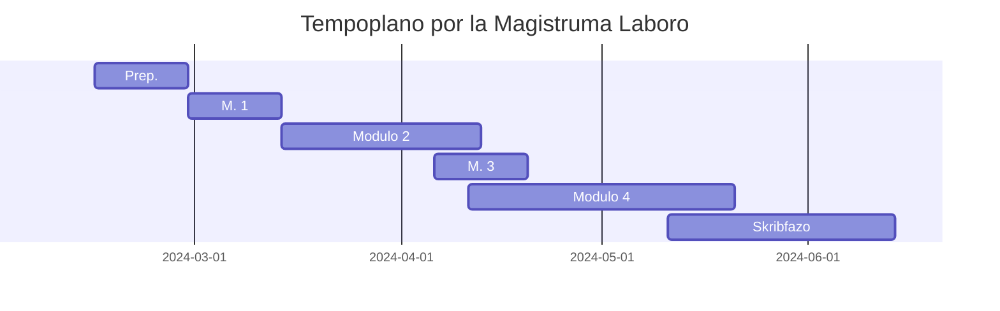

(ĉi tiu paĝo estis aŭtomate tradukita de [la germana originalo](https://david.krassnig.de/de/projects/ma-thesis/) en Esperanton kaj ne estis kontrolita mane)

## Ĝeneralaj Informoj

**Titolo:** Publikadaj Praktikoj por Esploraj Datenoj en Universitataj Disertaĵoj 
**Subtitolo:** Esplorado de Publikigaj Formatoj kaj Metodoj

**Universitato:** [Humboldt-Universität zu Berlin](https://www.hu-berlin.de/) 
**Fakultato:** [Filozofia Fakultato](https://fakultaeten.hu-berlin.de/de/philfak) 
**Instituto:** [Instituto pri Bibliotekaj kaj Informsciencaj Studoj](https://www.ibi.hu-berlin.de/de)

**Recenzisto 1:** [D-ro Sarah Dellmann](https://www.tib.eu/en/publishing-archiving/advisory-services-and-information/contact-persons-and-addresses-for-service) 
**Recenzisto 2:** [Prof. Dr. Robert Jäschke](https://amor.cms.hu-berlin.de/~jaeschkr/)

## Ekspozo

### Enkonduko

Ekzistas tri publikadaj formoj por esploraj datenoj (ED) en universitataj disertaĵoj (UD) :

1. Tute integritaj datumoj en UD (ekz., tabeloj kaj grafikoj enmetitaj en la PDF-dosiero de la UD),
2. Datenoj aldonitaj al UD (ekz., dosieroj alŝutitaj al la publika servilo de la universitato kune kun la PDF-dosiero de la disertaĵo)
3. Datenoj alŝutitaj al aparta deponejo, al kiuj estas referita en la UD

En la scienca konteksto, preskribaj artikoloj el la DFG-financita projekto _eDissPlus_  kaj la _Politiko pri Disertaĵo-rilataj Esploraj Datenoj_ de la Germana Nacia Biblioteko  pli ofte provizas gvidliniojn por trakti ED por UD. Tamen, ĝis nun mankas ampleksaj studoj pri la efikeco aŭ plenumo de tiuj gvidlinioj ĉe studentoj (ekz., tra korespondaj ekzamenreguloj kaj konsultoj pri tiu temo de universitataj bibliotekoj). Ĝis nun ekzistas plej multe nur alt-specializitaj kaj faktemaj esploroj.

Ĉi tiu magistruma laboro intencas provizi pli ĝeneralan esploron pri tio.

### Esplor-demando

#### Ĉefa Esplor-demando

Kiel estis publikigitaj ED de UD en la institucia deponejo de la Universitato Leibniz Hannover (LUH-Repositorium) ĝis inkluzive Decembro 2023?

Tio povas esti disigita en la sekvajn subordigitajn esplor-demandojn:

1. Por kia proporcio de UD estis ED publikigita kiel parto de la PDF-dosiero?
2. Por kia proporcio de UD estis ED publikigita kiel aparta dosiero en la formo de aldonaj materialoj?
3. Por kia proporcio de UD estis ED publikigita en aparta deponejo?
4. Kiel ED en UD estas markitaj kaj ligataj kun la teksto de la UD?
5. Kiel estas montrite en la metadatumoj de UD ke ekzistas rilataj esploraj datenoj?

#### Subsidiara Esplor-demando

Kiel ampleksaj rekomendoj rilate ED en UD jam estas ankrigitaj en ekzamenreguloj kaj aliaj gvidaj dokumentoj ĉe germanaj universitatoj?

### Metodologio

Por respondi tiujn esplor-demandojn, la laborprocezo por la magistruma laboro estas disigita en kvar modulojn:

1. La analizo de germanaj disert-reguloj kaj superregaj gvidlinioj rilate ED
2. La mana klasifikado de UD en la LUH-Repositorium rilate ED
3. La evaluado de la rezultoj el la unuaj du moduloj kun fokuso sur eblaj rekomendoj rilate ED
4. La trejnado de modelo por aŭtomata klasifikado de UD rilate ED bazita sur la rezultoj de la antaŭa mana klasifikada laboro

#### Modulo 1: Disert-reguloj

Ĉi tie, la disert-reguloj kaj aliaj rilataj gvidaj dokumentoj de simpla ekzemplo (n=173) de ĉiuj universitatoj rajtigita por disertado en Germanio (n=313) estas esploritaj. La grandeco de la ekzemplo estis kalkulita per konfidenca intervalo de 95&thinsp;% kaj erarolimo de 5&thinsp;%.

#### Modulo 2: Mana UD-Klasifikado

Ĉi tie, multnivela ekzemplo de UD en la LUH-Repositorium estas mane klasifikita laŭ tio ĉu la UD,

1. ne havas ED,
2. havas ED kiel parto de la PDF-dosiero,
3. havas ED kiel aldonitaj dosieroj, aŭ
4. havas ED en ekstera deponejo.

La ekzemplo estas tavoligitaj laŭ la fakultatoj de la LUH kaj laŭ kvar 3-jaraj etapoj. Por tiu ĉi modulo, mi ricevas administran aliron al la LUH-Repositorium. La preciza grandeco de la ekzemplo povas esti kalkulita nur per tiu aliro. La klasifikado mem konsideras la enhavon de la PDF-dosiero kaj la asociitajn metadatumojn en la LUH-Repositorium.

#### Modulo 3: Evaluo & Rekomendoj

Ĉi tie, la rezultoj de la unuaj du moduloj estas evaluataj, kaj konceptoj estas disvolvitaj bazitaj sur la akiritaj datumoj pri kiel pli bona traktado de ED en UD povas esti atingita kaj al kiuj celgrupoj tiuj penoj plej taŭgas.

#### Modulo 4: Trejnado de Klasifikada Modelo

Ĉi tie, la rezultoj de la antaŭa klasifikada laboro estas uzitaj por trejnado de modelo, kiu poste povas klasifiki la restajn UD en la LUH-Repositorium rilate al la statuso de ED. La trejnado kaj konstruo de la modelo orientiĝas, almenaŭ atendite, laŭ la laboro de Younes kaj Scherps pri identigo kaj ekstrakto de datenoj en sciencaj artikoloj .

Laŭ la disponebleco de rimedoj por kontroli la rezultojn de la LUH, aŭ unu-faza proceduro (rekte identigo kaj ekstrakto per antaŭtrejnita lingva modelo kiel DeBERTa en demando-responda reĝimo) aŭ du-faza proceduro (filtrado per MLP kun poste ekstrakto per antaŭtrejnita lingva modelo kiel RoBERTa) povas esti uzitaj. La unua havas (laŭ antaŭaj atendoj) pli altan precizecon kaj postulas malpli da posta laboro, sed havas malpli altan konscion. La dua havas (laŭ antaŭaj atendoj) pli altan konscion sed malpli altan precizecon.

### Tempoplano

    <b>Figuro:</b> Provizora tempoplano por la traktado de la magistruma laboro kiel Gantt-diagramo.

### PDF-Version

Vi povas elŝuti germanan PDF-version de ĉi tiu ekspluato (sen Gantt-tempoplano) [ĉi-tie](https://david.krassnig.de/assets/pdf/krassnig-mathesis-expose.pdf).

## Aktuala Stato

- [x] **Antaŭprepara Fazo**
  - [x] Krei (Lua)LaTeX-ŝablonon (havebla ĉe [GitHub](https://github.com/DavidKrassnig/abschlussarbeit_lualatex_vorlage_hu-berlin))
  - [x] Akiri aliron al [TIB Confluence](https://wiki.tib.eu/confluence/)
  - [x] Akiri aliron al [TIB Remote Desktop](https://rdgw01.rds.tib.eu/)
    - [ ] ~~Opcie: Faru laŭeble aliri al la Linux-sistemo~~
  - [x] Akiri administra aliron al la [LUH-Repositorium](https://www.repo.uni-hannover.de/)
- [x] **Labora Fazo**
  - [x] Modulo 1
    - [x] Listo de ĉiuj germanaj universitatoj
    - [x] Filtri liston laŭ rajto por doktoriĝo
    - [x] Krei skripton por sembaza hazarda elekto el universitatolisto (**Rezulto:** elŝuteble [ĉi tie](https://github.com/DavidKrassnig/simple-csv-sampler))
    - [x] Prendi simplan hazardan muestron
    - [x] Kolekti doktorajn reguligojn kaj aliajn rilatajn dokumentojn de la muestro
    - [x] Evalui doktorajn reguligojn de la muestro
- [x] Modulo 2
  - [x] Elŝuti metadatumojn de ĉiuj [LUH Deponejo](https://www.repo.uni-hannover.de/) disertaĵoj
  - [x] Trovi manieron por aŭtomate elŝuti ĉiujn koncernajn dosierojn
    - [x] Kontroli ĉu DSpace 5 provizas internan funkcion (**Rezulto:** ne havebla)
    - [x] Krei skripton kiu elŝutas ĉiujn PDF dosierojn kaj akompanajn dosierojn
  - [x] Krei skripton por stratifiki disertaĵojn en Jaro+Fakultato grupoj
  - [x] Preni stratifitan hazardan ekzemplon
    - [x] Revaluti stratifikadon bazita sur eligo (**Rezulto:** ŝanĝi al 3-jara grupigoj kun po 4 jaroj anstataŭ 4-jara grupigo kun po 3 jaroj)
  - [x] Elŝuti ĉiujn koncernajn dosierojn
  - [x] Decidi pri metadatuma skemo por klasifiki esplorajn datumojn por poste klasifiki alŝuton en DSpace
  - [x] Evalui ĉiujn disertaĵojn
    - [x] Kontroli internajn esplorajn datumojn
    - [x] Kontroli akompanajn esplorajn datumojn
    - [x] Kontroli eksterajn esplorajn datumojn
  - [x] Modulo 3
  - [x] Modulo 4
    - [x] Ordigi PDF-dosierojn
    - [x] Instali Grobid
    - [x] Konverti PDF-dosierojn al TEI-XML-dosieroj
    - [x] Ordigi TEI-XML-dosierojn laŭ lingvo
    - [x] Kontroli la kvaliton de TEI-XML-dosieroj
    - [x] Krei CSV-datumbazon (bazitan sur paragrafoj)
    - [x] Klasifiki paragrafojn de la datumbazo
    - [x] Verki skripton por trejni la modelon
    - [x] Taksi efikecon
- [x] **Skriba Fazo**
  - [x] Enkonduko
    - [x] Unua skizo
    - [x] Fina versio
  - [x] Modulo 1
    - [x] Unua skizo
    - [x] Fina versio
  - [x] Modulo 2
    - [x] Unua skizo
    - [x] Fina versio
  - [x] Modulo 3
    - [x] Unua skizo
    - [x] Fina versio
  - [ ] ~~Modulo 4~~
  - [x] Fino
- [x] **Sendo**
  - [x] Alŝuti al Zenodo kun embargo
    - [x] Magistriĝo (**DOI:** [10.5281/zenodo.11506621](https://www.doi.org/10.5281/zenodo.11506621))
    - [x] Datumaro (**DOI:** [10.5281/zenodo.11401021](https://www.doi.org/10.5281/zenodo.11401021))
  - [x] Doni al presejo
  - [x] Sendi per poŝto
  - [x] Sendi per retpoŝto
